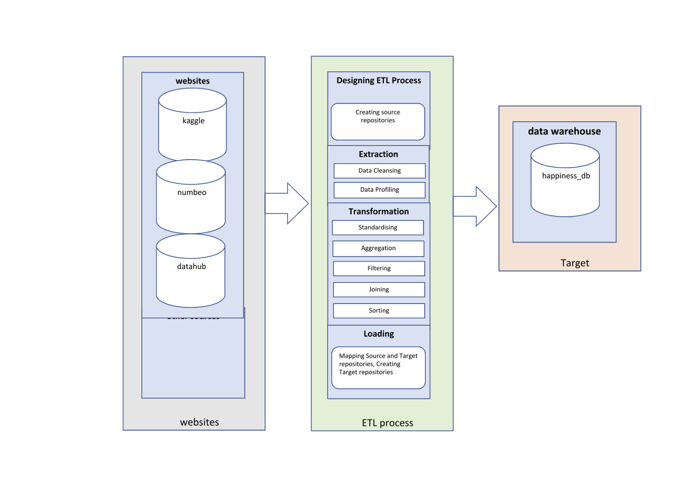

ETL Project by Save the Data Team
===============

### Project to Summary:

The aim of this project was to build a database that would allow users to examine the relationship between a country’s happiness, as reported in the world happiness report, and its average cost of living.  We assumed that countries with a higher happiness score would have a higher cost of living, potentially reflecting an inverse association ie happier country = more expensive to live in. The end result a database that enables users to query on the intersection of multiple datasets for further and more detailed analysis.   

### Prepared By:

* Yann Chye
* Baili Li (Esther)
* Michelle Hocking
* Eamonn McCallum
***

### Dependencies:
* Python version 3.x (minimum)
* Dependant Python modules are listed in *00_config/requirements.txt*. if installation or confirmation is required run the follow command from terminal/gitbash
 ***pip install -r requirements.txt***.
* A kaggle account, and an ‘api_key.py’ file containing your kaggle username and a user-specific kaggle api key (refer to https://github.com/Kaggle/kaggle-api). This is needed to be able to interact with the kaggle api to extract their dataset. A template ‘api_key_template.py’ file is available in the ‘00_config’ folder. Populate it with your username and api key, rename it to ‘api_key.py’, and move it into the root folder.
* postgreSQL, with a ‘password.py’ file containing your password. A template ‘password_template.py’ file is available in the ‘00_config’ folder. Populate it with your postgreSQL username and password (default username is ‘postgres’), rename it to ‘password.py’, and move it into the root folder.

### Code Execution:
Notebooks should be run in the following order 
  * 01 (extract) > 02 (transform) > 03 (load) 
  * 02_transform_country.ipynb > either of 02_transform_coli.ipynb and 02_transform_happiness.ipynb

### ELT Diagram
  

**Git Repository Map:**

| Directory | Description | From Notebook(s)
| --------  | ------------------- | ------------------- | 
| 00_config | Python and Text file to locally store API Keys and Passwords |  |
| 01_extract_Coli| Files extracted by scraping Cost of Living Data source| 01_extract_coli.ipynb |
| 01_extract_country | Files extracted by scraping country data|01_extract_country.ipynb | 
| 01_extract_happiness | Files extracted by scraping and unziping from Kaggle | 01_extract_happiness.ipynb| 
| 02_transform_coli | Cleaned CSV Files  | 02_transform_coli.ipynb| 
| 02_transform_country | Cleaned CSV Files | 02_transform_country.ipynb| 
| 02_transform_happiness | Cleaned CSV Files | 02_transform_happiness.ipynb | 
| 03_load | Contains our Entity Relationship Diagram, code for loading our database in notebook | 03_load.ipynb | 
| 04_results | Result SQL queries and output CSVs  |  | 
| report | Contains report Document  |  | 

  

  
